# Mini Project-Basic Linux Commands
---

**What is a Linux Command?**

A Linux command refers to a program or utility that runs in the command-line interface (CLI). The CLI is a text-based environment where you interact with the system by typing commands.

Linux commands are executed by entering the text in the Terminal and pressing Enter. These commands enable you to perform a wide range of tasks, including installing packages, managing users, manipulating files and directories, configuring system settings, and more.

A command may consist of options and parameters, but they are not always required. Here are the key components of a command.

* **CommandName:** This represents the action or task you want to perform using the command. For example, if you wish to list files in a folder, you basically use the **`ls`** command.

* **Option or Flag:** An option modifies the behavior of a command. It is typically preceded by  a hyphen (-) or double hyphen (--) and can be used to customize the command's functionality. For example, if I want to show extra information for each listed file, I will run the command **`ls -l`**

* **Parameter or Argument:** A parameter provides specific information or data by the command to execute the desired action. For example, if I want to create a new directory (folder), I will use **`mkdir`** command. The parameter will be the name of the directory in which I will pass to it. For example, **`mkdir photos`** will create a **photos** directory.

It is important to known that Linux commands are case-sensitive, so you need to enter them exactly as they are spelled and formatted.

**Manipulating files and directories on Linux**

* **The **`sudo`** command:** In Linux, some actions need special permission to be carried out, like creating files in certain areas or changing important system settings. This is where the **sudo** command comes into play. "sudo" stands for "superuser do", and it allows you to run commands with the security privileges of another user, typically the superuser or "root."

* **The **`pwd`** command:** This command is used to find the path of your working directory. By entering `pwd` command, it will return the full curent path - a path of all the directories that starts with a forward slash (/). For example, **`/home/username`**.

* **The **`cd`** command:** This command is known as "change directory". It is uded to navigate through the Linux directories. For example, **cd /home/Downloads** to navigate into the Downloads directory.

**The Linux directory structure**

It is crucial to understand how the Linux filesystem is organized. This knowledge is fundamental when navigating through the system, managing files, and understanding where different types of files and directories reisde.

**The Root Directory (/):** At the top of the Linux filesystem hierarchy is the root directory, denoted by  a single slash "/". Unlike Windows which uses different drives ('C', 'D', etc), Linux organizes everything starting from this root directory. Under **'/'**, you will find various directories with specific purposes:

* **/bin:** This is where essential binaries (programs) that need to be available to all users are stored.

* **/etc:** This is where configuration files for the system are found.
* **/home:** Personal directories for users.

* **/root:** The home directory for the root user.

* **/var:** This is where variable data like logs are found.

* **/usr:** Secondary hierarchy for user data. It contains majority of user utilities and applications.

**Side Hustle Task 1:**

* create a directory called **'photos'** inside the **'/usr'** directory.

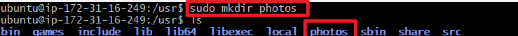

* Navigate into the **'photos'** directory.

* Create 3 more random directories inside the **'photos'** directory.

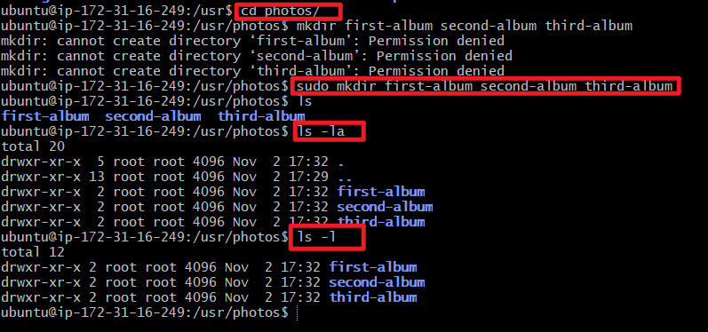

* Show the newly created directories on the terminal.

* Navigate into one of them.

* Show the full path where you currently are on the screen.

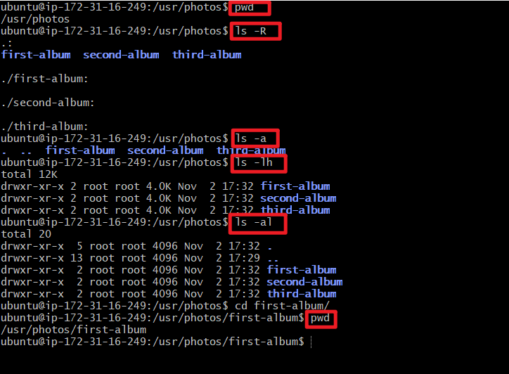

* **The **`cat`** command:** "concatenate" or "cat", is one of the most frequently used Linux commands. It lists, combines, and writes file content to the standard output (to the terminal console). To run the **"cat"** command, type cat follwed by the file name and its extension. For example;

    **`sudo cat /etc/os-release`**

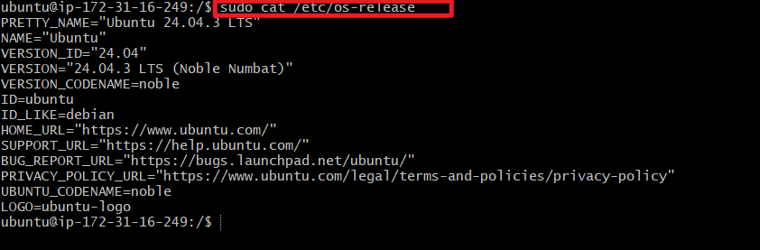   

* **The **`cp`** command:** This command is used to copy files or directories and their content. To copy one file from the current directory to another, enter **cp** followed by the file name and the destination directory. For example;

    **`cp project.txt /home/ubuntu/Documents`**

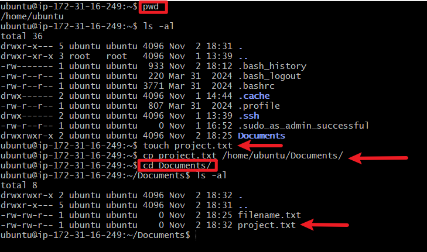

This command can as well be used to copy multiple files to a directory. For example;

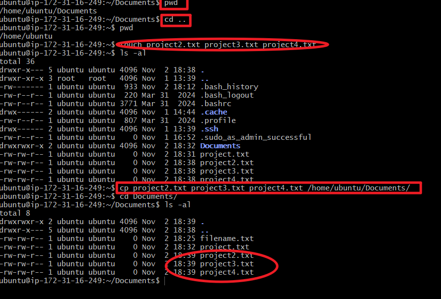

To copy the content of a file to a new file in the same directory, enter **cp** followed by the source file and the destination file. For example;

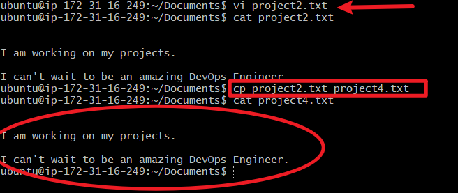

To copy an entire directory, pass the -R flag before typing the source directory, followed by the destination directory. For example;

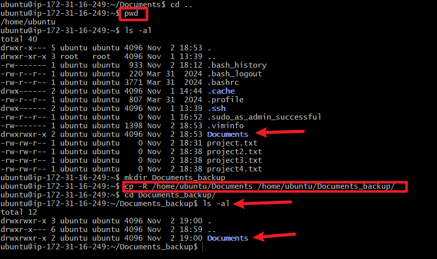

* **The **`mv`** command:** This command does two things. It can be use to move and rename files and directories. For example, to move a file **"mini-project.txt"** to the **"/home/ubuntu/Documents_backup"** directory.

    **`mv mini-project.txt /home/ubuntu/Documents_backup`**

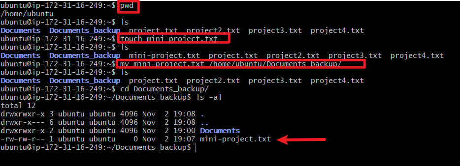

* The **mv** command can be use to rename a file. For example;
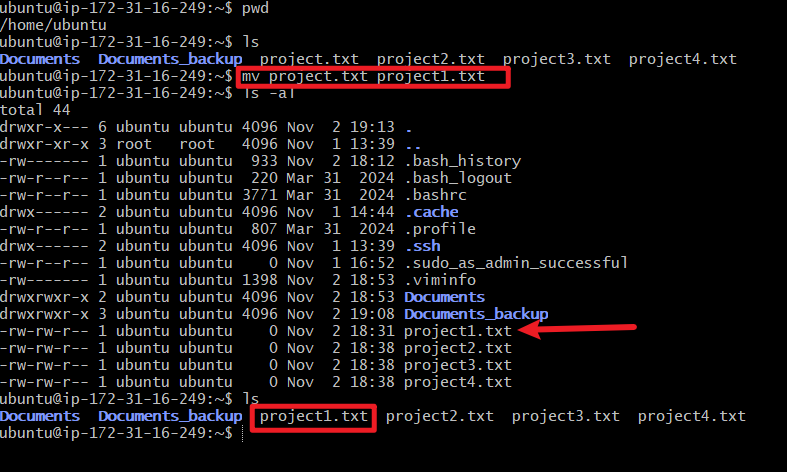

* **The **`rm`** command:** This command is used to delete files within a directory.

    **caution:** This is a very dangerous command as it deletes the files completely. It must be used with care. This command can be use to remove a single file and multiple files. For example;

Here are some acceptable options you can add to the rm command.

* -i prompts system confirmation before deleting a file. (Denotes "interractive")

* -f allows the system to remove without a confirmation. (Denotes "force")

* -r deletes files and directories recursively.

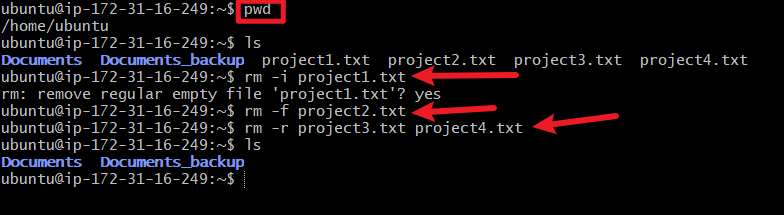

* **The **`touch`** command:** This command allows you to create an empty file. For example, enter the following command to create an HTML file named Web in the Documents directory.

    **`touch /home/ubuntu/Documents/Web.html`**

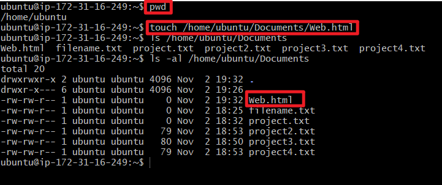

* **The **`find`** command:** This command is used to search for files within a specific directory and perform subsequent operations. For example, you want to look for a file called **"Web.html"** within the home directory and its subfolders:

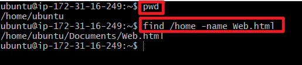

